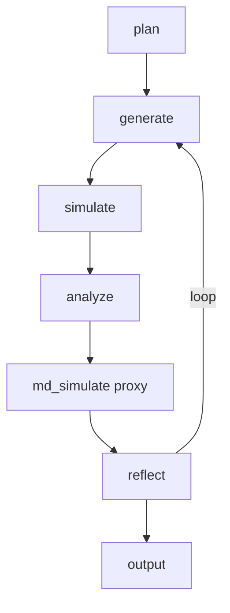
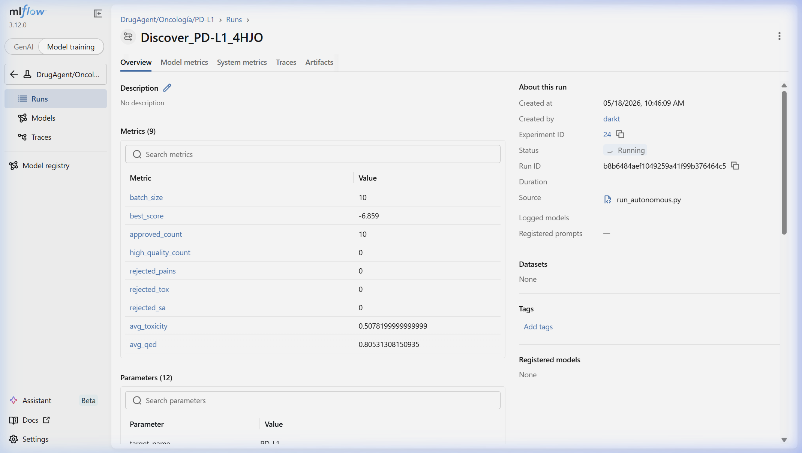
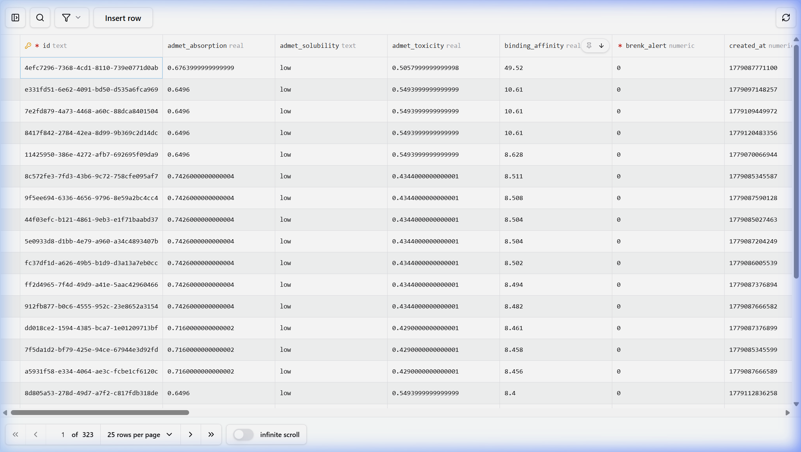

# DrugAgent

**Local-first agentic pipeline for *in silico* molecular discovery** — LangGraph, RDKit, optional AutoDock Vina, MLflow, Prisma, and ChromaDB.

> **Not a clinical tool.** See [DISCLAIMER.md](DISCLAIMER.md).

---

## What it does

| Layer | Role |
|-------|------|
| **LangGraph** | Closed loop: plan → generate → simulate → analyze → stability proxy → reflect |
| **RDKit** | SMILES generation, Lipinski, PAINS/Brenk, QED, Tanimoto diversity |
| **AutoDock Vina** | Real 3D docking when `tools/vina/vina.exe` is installed; otherwise **QSAR mock** |
| **MLflow** | Metrics, parameters (`docking_mode`), artifacts |
| **Prisma + SQLite** | Runs and candidates |
| **ChromaDB** | Text insights from the reflector (RAG for the generator) |
| **ChEMBL API** | Optional public evidence pack per run |

---

## Architecture (actual graph)



Pocket detection (DBSCAN + KDTree) runs **inside** `core/docking.py` when catalog coordinates are missing — not a separate LangGraph node.

---

## Curated targets

Defined in [`catalog/therapeutic_areas.yaml`](catalog/therapeutic_areas.yaml):

- **EGFR** (4HJO), **MPRO** / SARS-CoV-2 (6LU7), **DPP4** (3HAJ)
- **KRAS G12C** (6VXX), **PD-L1** (3K33)
- **DENV_NS3** (2M9P), **ZIKV_NS3** (7VLI), **RSV_F** (5C6B), **HIV1PR** (1HSG), **BACE1** (1W50)

Pairs `target` + `pdb_id` are validated at runtime ([`utils/target_validation.py`](utils/target_validation.py)) to avoid incoherent missions (e.g. PD-L1 with an EGFR structure).

---

## Quick start (Windows)

See **[INSTALL_WINDOWS.md](INSTALL_WINDOWS.md)**.

```powershell
git clone https://github.com/clevervi/DrugAgent.git
cd DrugAgent
python -m venv venv
.\venv\Scripts\activate
pip install -r requirements.txt
npx prisma db push
copy .env.example .env
# Edit .env: LOCAL_LLM_BASE_URL + ollama pull <your-model>
python run_agent.py --target EGFR --pdb 4HJO --iterations 3
```

**Ollama:** use the exact tag from `ollama list` in `LOCAL_LLM_MODEL` (e.g. `llama3.2`, `qwen2.5-coder:7b`).

**Vina:** place `vina.exe` under `tools/vina/vina.exe` for real docking.

---

## Configuration modes

| Goal | `.env` |
|------|--------|
| Local LLM | `LOCAL_LLM_BASE_URL=http://localhost:11434/v1` |
| Heuristics only | `OFFLINE_MODE=True` |
| Cloud LLM | `GROQ_API_KEY` and/or `GEMINI_API_KEY` (optional) |
| Force mock docking | `DOCKING_MODE=mock` |
| Force real docking | `DOCKING_MODE=real` (requires Vina) |

---

## Dashboards

```powershell
mlflow ui --backend-store-uri sqlite:///./data/mlflow.db --port 5000
npx prisma studio --url file:./data/drugagent.db
streamlit run ui/dashboard.py
```

 · 

---

## Tests

```powershell
python scripts/test_all.py
python scripts/test_guardrails.py
python scripts/fetch_chembl_evidence.py --target EGFR --pdb 4HJO
```

---

## Limitations (read before citing results)

1. **Mock docking** — deterministic QSAR-like score, not Vina energy, when the binary is missing.
2. **MD node** — stability **proxy**, not OpenMM/GROMACS trajectories.
3. **ADMET** — ML/heuristic proxies, not experimental DMPK.
4. **ChEMBL** — REST API for reference context; docking kcal/mol ≠ IC50.
5. **Skills `exec()`** — only allowlisted stems in `config.yaml` → `skills.exec_allowlist`.

Details: [DISCLAIMER.md](DISCLAIMER.md) · Security: [SECURITY.md](SECURITY.md)

---

## License

MIT — see [LICENSE](LICENSE).

*Developed by [clevervi](https://github.com/clevervi)*
