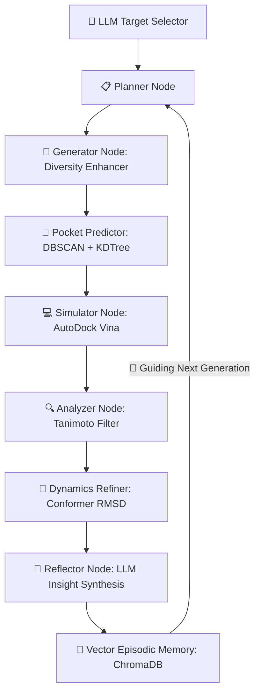

# 🧬 DrugAgent: Platform for Autonomous Closed-Loop AI Molecular Discovery

> **Autonomous Multi-Agent Orchestration • Local LLMs • MLOps Telemetry • Computational Biophysics**

---

### [English]
**DrugAgent** is a state-of-the-art, fully autonomous closed-loop platform designed for automated in-silico drug discovery. Orchestrated with a non-linear state graph architecture, it autonomously predicts binding pockets, designs novel chemical candidates, runs physical molecular docking simulations, evaluates structural dynamics, logs high-fidelity telemetry, and stores cognitive research insights for iterative molecular optimization.

### [Español]
**DrugAgent** es una plataforma de descubrimiento de fármacos completamente autónoma y de bucle cerrado (*closed-loop*). Orquestada mediante un grafo de estados no lineal, predice cavidades de unión, diseña candidatos químicos, simula docking molecular físico, evalúa dinámica conformacional, registra telemetría de alta fidelidad y almacena reflexiones cognitivas para guiar la optimización molecular iterativa.

---

## 🏗️ Architecture & Agentic Flow / Arquitectura y Flujo Agéntico



### The Nodes / Los Nodos:
1. **Target Selector**: Autonomously decides therapeutic targets (e.g., KRAS, PD-L1) based on medical objectives, applying safe offline fallbacks if PDB structures are cached locally.
2. **Planner**: Analyzes pocket coordinates, sets up execution states, and creates structural design hypotheses.
3. **Generator**: Employs structural diversity algorithms (RDKit / Morgan Fingerprints) to generate novel molecular analogs avoiding local minima.
4. **Pocket Predictor & Simulator**: Calculates binding pockets dynamically (Scikit-Learn **DBSCAN** spatial clustering + **KDTree**) and executes parallel virtual screening using **AutoDock Vina**.
5. **Analyzer**: Filters ligands based on binding affinities, safety thresholds, and strict structural blacklist Tanimoto distance calculations.
6. **Dynamics Refiner**: Measures structural conformer stability and RMSDs.
7. **Reflector & Memory**: Synthesizes structured biophysical insights, writing them to **ChromaDB** vector memory to guide subsequent generational rounds.

---

## 🛠️ Key Technological Pillars / Pilares Tecnológicos Clave

### 1️⃣ Advanced Agentic Engineering (LangGraph & Ollama)
* **EN:** Custom `StateGraph` loops running under a completely local AI stack. Employs `gemma4:e4b` on **Ollama** for orchestration, planning, and molecular reflection without incurring API costs or data privacy leakage.
* **ES:** Bucles de estado `StateGraph` personalizados corriendo sobre una pila de IA 100% local. Emplea `gemma4:e4b` en **Ollama** para la planificación y reflexión sin costes de API ni filtración de datos.

### 2️⃣ MLOps & Telemetry Tracking (MLflow)
* **EN:** Every experiment run registers directly to **MLflow**. It tracks binding affinities, pocket centers, molecular weight, dynamic conformer RMSD stability, and logs the resulting 3D atomic pose (`.pdbqt` coordinates) as versioned artifacts.
* **ES:** Cada experimento se registra directamente en **MLflow**. Rastrea afinidades de docking, centros de bolsillo, peso molecular, estabilidad RMSD y guarda la pose atómica 3D (`.pdbqt`) como artefacto versionado.


### 3️⃣ Cognitive Hybrid Storage (Prisma SQL + ChromaDB)
* **EN:** Structured relational schema tracks running metadata and candidate scores via **Prisma ORM**, while long-term cognitive insights are vectorized and queried inside a **ChromaDB** vector store to establish feedback memory.
* **ES:** Esquema relacional estructurado que rastrea corridas y candidatos vía **Prisma ORM**, combinándolo con indexación semántica en **ChromaDB** para construir memoria cognitiva episódica.


### 4️⃣ Geometry & Computational Biophysics (RDKit & Vina)
* **EN:** Performs dynamic binding pocket prediction using spatial density clustering (**DBSCAN**) on apo-protein coordinates. Implements diversity checks using Morgan Fingerprints and calculates 3D conformer RMSD profiles.
* **ES:** Predice bolsillos activos dinámicos mediante clustering de densidad espacial (**DBSCAN**) sobre coordenadas de la proteína. Filtra redundancias químicas usando Morgan Fingerprints y distancia Tanimoto.

---

## 🚀 Installation & Local Setup / Instalación y Configuración Local

### Prerequisites / Requisitos:
* Python 3.10+
* Node.js (for Prisma Studio CLI)
* Ollama (with `gemma4:e4b` model pulled: `ollama pull gemma4:e4b`)
* AutoDock Vina binary configured in system paths (or inside the execution environment).

### Step-by-Step Guide / Guía Paso a Paso:

1. **Clone the Repository / Clonar el Repositorio:**
   ```bash
   git clone https://github.com/clevervi/DrugAgent.git
   cd DrugAgent
   ```

2. **Configure Virtual Environment & Dependencies / Configurar Entorno y Dependencias:**
   ```bash
   python -m venv venv
   source venv/bin/activate  # On Windows: venv\Scripts\activate
   pip install -r requirements.txt
   ```

3. **Database Initialization / Inicialización de la Base de Datos:**
   ```bash
   npx prisma db push
   ```

4. **Environment Setup / Configuración del Entorno (`.env`):**
   Create a `.env` file in the root directory:
   ```env
   LOCAL_LLM_MODEL=gemma4:e4b
   LOCAL_LLM_BASE_URL=http://localhost:11434/v1
   OFFLINE_MODE=True
   DATABASE_URL="file:./data/drugagent.db"
   ```

5. **Run the Autonomous Loop / Ejecutar el Bucle Autónomo:**
   ```bash
   python run_autonomous.py
   ```

6. **View Dashboards / Visualizar Paneles:**
   * **MLflow Tracking UI:** `mlflow ui --backend-store-uri sqlite:///./data/mlflow.db` (Open `http://localhost:5000` to inspect versioned 3D poses and metrics).
   * **Prisma Studio:** `npx prisma studio --url file:./data/drugagent.db` (Open `http://localhost:5555` to view candidate database).

---

## ⚠️ Limitations & Disclosures / Limitaciones y Transparencia Científica

### [English]
**DrugAgent** is an advanced AI/MLOps platform designed for **academic demonstration and in-silico discovery pipeline testing**. It is not a clinical tool, and simulated results must never be interpreted as validated biological activity. Please note the following engineering configurations:
1. **Biophysical Docking Fallback Mode**: The platform performs physical virtual screening using **AutoDock Vina** locally when the binary is configured. If the Vina executable is not detected, the simulator automatically falls back to a **QSAR-like deterministic descriptor mock model** to ensure seamless offline demo execution.
2. **Molecular Dynamics (MD) Refinement**: The conformer refinement step in `md_simulator.py` utilizes a **lightweight biophysical stability proxy calculation** (based on conformer RMSDs and structural geometry metrics in RDKit), rather than running complex thermodynamic molecular mechanics engines (such as OpenMM, AMBER, or GROMACS).
3. **Local AI Model Stack**: The default LLM is configured to run on a local Ollama server (pulling `llama3` or `qwen2.5-coder:7b` by default, easily customizable to Google's `gemma4:e4b` or any OpenAI-compatible API).
4. **Data Privacy & APIs**: The search engine uses public REST APIs (ChEMBL and RCSB PDB) to retrieve target structures and empirical activity reference lists. In offline mode, the agent utilizes local target catalog files and mocked fallbacks.

### [Español]
**DrugAgent** es una plataforma avanzada de MLOps y diseño agéntico orientada a la **demostración académica y validación de tuberías de descubrimiento in-silico**. No es una herramienta clínica, y los candidatos simulados nunca deben interpretarse como compuestos con actividad biológica empírica. Considera las siguientes especificaciones técnicas:
1. **Modo de Fallback en Acoplamiento Biofísico**: La plataforma ejecuta cribado virtual físico mediante **AutoDock Vina** localmente si el binario está en la ruta. Si no se detecta el ejecutable de Vina, el simulador cae automáticamente en un **modelo mock QSAR determinista** basado en descriptores para garantizar una ejecución fluida y sin fricciones de la demo.
2. **Dinámica Molecular (MD) Refinada**: El paso de refinamiento conformacional en `md_simulator.py` utiliza un **cálculo de proxy de estabilidad biofísica** (basado en perfiles de RMSD de conformeros generados con RDKit) en lugar de inicializar un motor de mecánica molecular termodinámica pesado (como OpenMM, AMBER o GROMACS).
3. **Pila de Modelos de IA Local**: El LLM por defecto está configurado para ejecutarse localmente con Ollama (`llama3` o `qwen2.5-coder:7b` por defecto, fácilmente adaptable a `gemma4:e4b` u otros LLMs locales o en la nube mediante API keys de Groq/Gemini).
4. **Privacidad de Datos y APIs externas**: El módulo de recopilación de evidencia realiza peticiones HTTPS opcionales a bases de datos públicas (ChEMBL y RCSB PDB) para extraer dianas reales y ligandos de referencia. En modo offline estricto, el agente emplea catálogos locales y proxies simulados.

---

## 📈 Verifications & Tests / Verificaciones y Pruebas

Run the comprehensive unit test suite targeting molecular similarity calculations, Tanimoto diversity, and encoding protections:
```bash
python scratch/test_improvements.py
```

---

## 📄 License / Licencia

This project is licensed under the **MIT License** - see the [LICENSE](LICENSE) file for details.
Este proyecto está bajo la Licencia **MIT** - consulta el archivo [LICENSE](LICENSE) para más detalles.

---
*Developed with 🧬 by [clevervi](https://github.com/clevervi) (Adrián Darío V.)*
